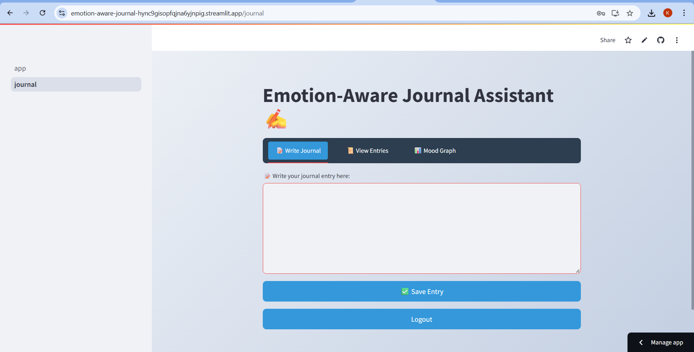

#  Emotion-Aware Journal

Emotion-Aware Journal is a personalized journaling web app that uses Natural Language Processing (NLP) to detect emotions from user-written journal entries. The app helps users reflect on their emotions over time and supports emotional awareness and mental well-being.

##  Features

-  **User Authentication** via Firebase.
-  **Personalized Journal Entries** stored in Firebase Realtime Database.
-  **Emotion Detection** using a fine-tuned BERT-based uncased model from Hugging Face Transformers, trained on the **GoEmotions** dataset (Kaggle). It currently identifies **28 different emotions**.
-  **View Past Entries** along with detected emotions and dates.
-  **Delete Entries** with a single click.
-  Built with a focus on **scalability** and future enhancement of the emotion detection model.

##  Live Demo

🔗 [Click here to open the app](https://emotion-aware-journal-hync9gisopfqjna6yjnpig.streamlit.app/)

##  Screenshots

To add screenshots:
1. Create a `screenshots/` folder in your GitHub repo.
2. Upload images like `homepage.png`, `journal_entry.png`, etc.
3. Use markdown to display them:

```markdown




```

Place them here in this section for visual reference.

##  Technologies Used

- [Streamlit](https://streamlit.io/) – Frontend UI
- [Firebase Authentication](https://firebase.google.com/products/auth) – User login and registration
- [Firebase Realtime Database](https://firebase.google.com/products/realtime-database) – Entry storage
- [Hugging Face Transformers](https://huggingface.co/transformers/) – BERT model for emotion classification
- [GoEmotions Dataset](https://www.kaggle.com/datasets) – Dataset used for training emotion classifier

## ⚙ Prerequisites

Make sure you have the following installed:

- Python 3.8+
- `pip`
- Firebase Admin SDK credentials (as `firebase_service_key.json` or stored in Streamlit secrets)

Install dependencies:

```bash
pip install -r requirements.txt
```

## 🗂 Project Structure

```
emotion-aware-journal/
├── app.py
├── firebase_setup.py
├── pages/
│   ├── journal.py
│   └── login.py
├── model/
│   └── emotion_classifier.py
├── firebase_service_key.json  # or set in secrets
├── requirements.txt
└── README.md
```

##  Security Considerations

- Keep your Firebase credentials secure. If deploying on Streamlit Cloud, store them in `st.secrets`.
- Authentication is handled via Firebase, ensuring secure sign-ins.

##  License

This project is licensed under the **MIT License** – see the [LICENSE](LICENSE) file for details.

##  Contact

For questions or feedback, feel free to open an issue or contact the maintainer:

**Mamatha Kollamaram**  
[GitHub Profile](https://github.com/Mamatha-Kollamaram)
